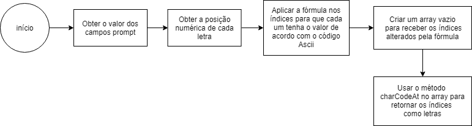

# cifra-de-cesar

Passos:

 - Obter o valor dos campos;
 - Obter a posição numérica de cada letra;
 - Obter o valor da tabela ascii 7 posições a frente;
 - Transformar o array de números em letras;
 - Juntar o array de letras em uma string e exibir.

Fluxograma

